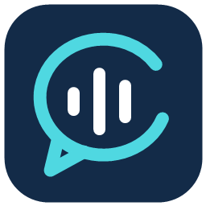
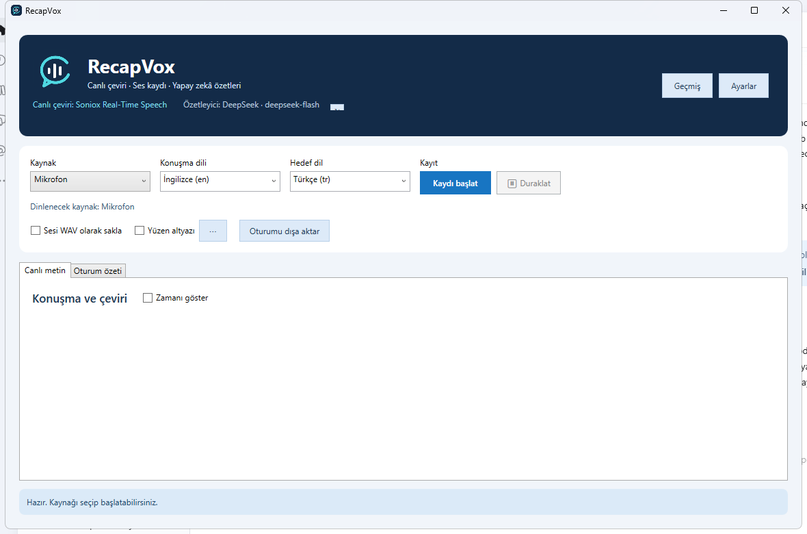
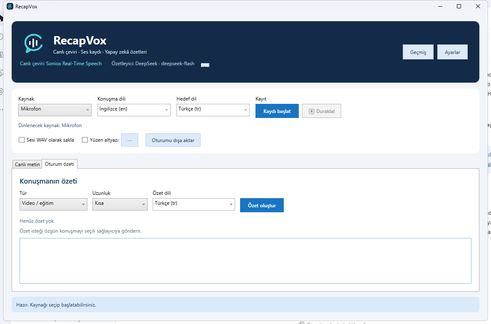

# RecapVox

**Live translation, audio recording, and AI meeting summaries for Windows 11.**

RecapVox listens to your microphone, a selected Windows application's audio, or a 16 kHz PCM WAV file. It displays original speech and translation in paired, timestamped blocks, can record audio, and saves searchable sessions with optional AI summaries. The Windows 11 x64 single-file EXE includes a stable .NET 10 runtime.







## Download and start

Download **RecapVox-win-x64-1.0.1.exe** from the [v1.0.1 release](https://github.com/ercanturhan/recapvox-live-translation-notes/releases/tag/v1.0.1) and double-click it. No separate .NET installation is needed. On first launch, the launcher extracts its private runtime to `%LOCALAPPDATA%\RecapVox\R`; later launches reuse that cache. An internet connection and your own provider API key are required for live translation and AI summaries. The EXE is currently unsigned, so Windows may show a publisher warning.

The download contains no API keys, recordings, or personal settings. Keys are stored in Windows Credential Manager for your Windows account. Moving the EXE to another folder on the **same** account does not remove existing keys; sharing the EXE does not share your keys.

## Features

| Area | What RecapVox offers |
| --- | --- |
| Live text | Original speech and translation in ordered sentence blocks. Show or hide timestamps without removing them from the saved session. |
| Audio sources | Microphone, one selected Windows application (including child processes), or a 16 kHz mono 16-bit PCM WAV file. Application audio and microphone can be mixed for meetings. Capture is application-level, not individual browser-tab capture. |
| Recording | Start, stop, pause, and resume; a timer pauses with the session. Optionally save the captured audio as WAV. |
| Floating subtitles | Show original text, translation, or both; choose side-by-side or stacked layout, window width, and font size from the `⋯` button beside **Floating subtitles**. Captions close when recording stops. |
| AI summaries | Generate a short or detailed meeting or video/training summary in a selected language. A summary is linked to its session and saved with date, provider, and model. |
| History | Search between sessions and within one session; open linked summaries and toggle transcript timestamps. Right-click to rename, copy, paste a duplicate, delete, refresh supported cost data, or export the session, summary, or both. |
| Export | PDF, TXT, and Markdown. PDF pages are rendered as images to preserve Turkish characters; choose TXT or Markdown for selectable/searchable text. |
| Preferences | Set the recording folder, providers, model, languages, and floating captions. Unsaved settings are flagged. Interface languages: English, Turkish, German, and Spanish. |
| Cost display | Available provider balance information in the header and per-session cost in History. Soniox usage requires a key with usage permission; DeepSeek token-based amounts are estimates. Unavailable balances are marked as such. |

The two language columns are paired in speech order. Their sentence boundaries can differ when a provider finalizes source and translation at different times. Mixed meeting audio is one mono stream, with no speaker identity or separate tracks.

## Configure live translation

1. Open **Settings → Live translation** and select a method below.
2. Use the **API key page** button, or the corresponding provider link, to obtain a key from your own account. Paste it into the matching password field. The hybrid method needs **both** Soniox and DeepSeek keys in separate fields.
3. Use each provider's **Save key** and **Test connection** buttons, then **Save and apply** at the bottom of Settings.
4. On the main window, choose the audio source and target language. Choose or auto-detect the spoken language where supported. Click **Start recording**, and pause or stop when needed.

| Live method | Key(s) | How it works |
| --- | --- | --- |
| **Soniox Real-Time Speech** | [Soniox Console](https://console.soniox.com/) | Soniox receives streamed audio and supplies original speech plus live translation. |
| **Soniox + DeepSeek** | [Soniox](https://console.soniox.com/) and [DeepSeek](https://platform.deepseek.com/api_keys) | Soniox transcribes audio; DeepSeek translates completed text blocks. The live DeepSeek key can differ from the summarizer key. |
| **OpenAI GPT-Realtime-Translate** | [OpenAI API keys](https://platform.openai.com/api-keys) | OpenAI receives audio and returns original and translated text. RecapVox resamples captured 16 kHz audio to 24 kHz. |
| **Gemini 3.5 Live Translate** | [Google AI Studio keys](https://aistudio.google.com/api-keys) | Gemini Live receives 16 kHz audio and returns original and translated text. |

Provider/model names reflect the implemented API paths; access, languages, availability, and pricing depend on your provider account. Soniox microphone and Edge/YouTube capture have been exercised with user audio. OpenAI, Gemini, and full hybrid audio sessions still need broader testing with real accounts. Language fields are searchable. OpenAI and Gemini detect the spoken language automatically. RecapVox displays translated text; it does not play translated speech.

For a Teams-style call, choose **Selected application**, select the Teams process, enable **Include microphone**, and start recording. For YouTube, select the browser playing audio. Browser selection captures that application's audio, including child processes; it cannot isolate one tab.

## Configure AI summaries

1. Open **Settings → Summarizer**. Select **DeepSeek**, **OpenAI**, **Gemini**, or **Claude** and enter a model name available to your account.
2. Obtain a key from [DeepSeek](https://platform.deepseek.com/api_keys), [OpenAI](https://platform.openai.com/api-keys), [Google AI Studio](https://aistudio.google.com/api-keys), or [Anthropic](https://console.anthropic.com/settings/keys). Use **Save key**, **Test connection**, then **Save and apply**.
3. Record and stop a session. The **Session summary** tab opens. Pick **Meeting** or **Video/training**, short or detailed length, and a summary language. Click **Generate summary**. Only then is the original transcript sent to the selected summarizer.
4. Open **History** later to find the linked transcript and dated summary.

The default model names are editable because account access and model availability can change. Transcripts longer than 60,000 characters are not yet split automatically for summarization. Provider API use may incur charges.

## Build from source

The repository includes WPF source, build scripts, tests, a sample WAV, and logo assets. It excludes local settings, Windows credentials, recordings, SDK downloads, build output, and packaged binaries.

Install the stable [.NET 10 SDK](https://dotnet.microsoft.com/en-us/download/dotnet/10.0) into `.dotnet-sdk` at the repository root; the scripts expect `.dotnet-sdk/dotnet.exe`. Microsoft's official `dotnet-install.ps1` can be run with `-Version 10.0.401 -Architecture x64 -InstallDir .dotnet-sdk -NoPath`.

```powershell
./run.ps1
# Build a single-file distribution:
./scripts/package-single-exe.ps1 -Version 1.0.1
# Run automated checks:
./.dotnet-sdk/dotnet.exe run --project tests/Translator.AudioChecks/Translator.AudioChecks.csproj
```

Play `samples/reference-en.wav` in a browser while that browser is selected as the audio source. Expected English text is in `samples/reference-en.txt`.

## Privacy and current limits

- API keys remain in Windows Credential Manager. Session JSON and optional WAV files go to the recording folder selected in Settings.
- Live providers receive audio or transcribed text according to the chosen method. A summary provider receives the original transcript only when **Generate summary** is clicked.
- Application capture covers the selected process and child processes, not a single tab. Mixed meeting audio has no speaker separation.
- This release is unsigned. Windows SmartScreen behavior and each live provider path should be tested on another Windows 11 x64 computer before broad deployment.
